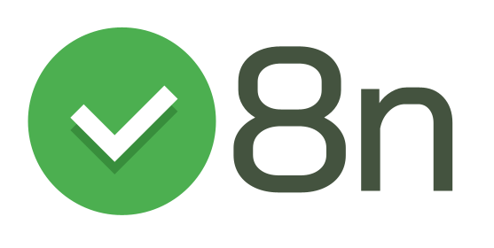

<p align="center">
  
</p>

<p align="center">
The ultimate JavaScript validation library you've ever needed.<br/>
Dead simple fluent API. Customizable. Reusable.
</p>

<p align="center">
<a href="#usage">Usage</a> - 
<a href="#installation">Installation</a> - 
<a href="#api">Documentation</a> 
</p>

```javascript
v8n()
  .number()
  .between(0, 100)
  .even()
  .not.equal(32)
  .test(74); // true
```

## Installation

```shell
# Using npm
npm install v8n

# or yarn
yarn add v8n
```

### Or using a `script` tag:

```html
<!-- From unpkg -->
<script src="https://unpkg.com/v8n/dist/v8n.min.js"></script>

<!-- or from jsdelivr -->
<script src="https://cdn.jsdelivr.net/npm/v8n/dist/v8n.min.js"></script>
```

## Usage

### Boolean based validation

We use the function [test](#test) to perform boolean based validations:

```javascript
import v8n from "v8n";

const isValid = v8n()
  .not.null()
  .string()
  .first("H")
  .last("o")
  .test("Hello");

isValid; // true
```

### Exception based validation

We can also use the [check](#check) function to perform exception based
validations. This is going to throw an exception when the validation fails:

```javascript
import v8n from "v8n";

try {
  v8n()
    .number()
    .between(10, 20)
    .check(25);
} catch (ex) {
  console.log(ex.rule.name); // "between"
  console.log(ex.rule.args); // [10, 20]
  console.log(ex.value); // 25
  console.log(ex.cause); // Rule failed!
}
```

> The exception thrown by the `check` function contains useful information about
> the rule which caused the validation fail, and it also has information about
> the validation process. Look and the [ValidationException
> docs](#validationexception) section to learn more about it.

### And more...

There are a lot of useful standard rules to use already implemented in
the core. Look at the [API section](#api) of this document.

You can also [implement your own rules](#extend), and share them between your
projects, or even with the community.

## Custom validation rules

To create custom validation rules, you just need to call the `v8n.extend`
function passing an object with your custom rules:

```javascript
import v8n from "v8n";

v8n.extend({
  myCustomRule: function(expected) {
    return value => value === expected;
  }
});
```

And now you can use your custom rule in a validation as you do with standard
rules:

```javascript
v8n()
  .string()
  .myCustomRule("Hello")
  .test("Olá"); // false
```

> To learn more about custom rules and how to implement them, look at the
> [v8n#extend](#extend) documentation section.

## The `not` modifier

The `not` modifier can be used to invert a validation rule. Suppose we
have a validation like:

```javascript
v8n()
  .includes("World")
  .test("Hello World!"); // true
```

Here, we're declaring a validation to check if the value includes a
`"World"` string. And the test returns `true`.

But we could want a validation with the inverse meaning. We can do that
with the `not` modifier:

```javascript
v8n()
  .not.includes("World")
  .test("Hello World!"); // false
```

Now, we have a validation to check if the value **does not** include a `"World"`
string. And the test returns `false`.

> The `not` modifier inverts the meaning only of the next `rule`, the rule
> declared right after it. So for each rule you want to invert its meaning, you
> should use the `not` modifier before it.
>
> To learn more about the `not` modifier, look at [its documentation](#not).

## Why another validation library?

We have a lot of great libraries about input field validation. 
But we often need something independent of the way we're going to use it.

We usually need some kind of in-code validation so we can use that same
validation in an input field, in a function call, in the server logic, ect...
Actually, we need the same validation and the same logic almost everytime, even
between different projects.

That's all about the `v8n` validation library. This is 'not' another input field
validation library.

This is a powerful engine for validation creation, reuse, and in-code validation
execution.

With the `v8n` we can write our validation strategies and reuse them whenever we
need. Actually, we can reuse validation from other people, and in a really
simple way.

## Features

-   Fluent and chainable API;
-   Useful standard validation rules;
-   Custom validations rules;
-   Reusability;

## Fluent and chainable API

The `v8n` library has a fluent chainable API. This help us to easily create
validation objects.

```javascript
v8n()
  .not.null()
  .between(100, 200)
  .even()
  .not.between(40, 60);
```

## Reusing validations

To reuse a validation strategy, you just need to declare it, export it in
someway, and import it from your code:

_myValidation.js_

```javascript
import v8n from "v8n";

// Export the validation object
export default v8n()
  .array()
  .not.empty()
  .minLength(3)
  .maxLength(10)
  .includes("Hello");
```

_myApp.js_

```javascript
// Import the validation object somewhere
import myValidation from "./myValidation";

myValidation.test(["Hello", "World", "!"]); // true
myValidation.check(["Hello", "Hi", "How is it going?"]); // No exception thrown!
```

## Sharing custom validation rules

You can write custom validation rules and reuse them in other projects. You
can also use rules from other people.

To export validation rules, create a `.js` file contain a call to the v8n static
[extend](#extend) function with your custom rules declared in a object, and then
export this file someway. So you can import this file from another source code,
and your custom validation rules will be available like the standard ones:

_myCustomRules.js_

```javascript
import v8n from "v8n";

v8n.extend({
  // "one" is a custom rule
  one() {
    return value => value == 1;
  },

  // "two" is another custom rule
  two() {
    return value => value == 2;
  }
});
```

And in another file or even another project, import the file with the custom
rules and use them like you do with standard rules:

```javascript
import v8n from "v8n";
import "myExternalProject/myCustomRules.js";

v8n()
  .number()
  .one()
  .test(1); // true

v8n()
  .string()
  .two()
  .test("2"); // true
```

> You can mix custom and standard rules as you want.

## API

<!-- Generated by documentation.js. Update this documentation by updating the source code. -->

#### Table of Contents

-   [v8n](#v8n)
    -   [extend](#extend)
-   [Validation](#validation)
    -   [Examples](#examples-1)
-   [Rule](#rule)
    -   [Parameters](#parameters-1)
-   [core](#core)
    -   [test](#test)
    -   [check](#check)
-   [ValidationException](#validationexception)
    -   [Parameters](#parameters-4)
-   [modifiers](#modifiers)
    -   [not](#not)
-   [rules](#rules)
    -   [pattern](#pattern)
    -   [equal](#equal)
    -   [exact](#exact)
    -   [string](#string)
    -   [number](#number)
    -   [boolean](#boolean)
    -   [undefined](#undefined)
    -   [null](#null)
    -   [array](#array)
    -   [lowercase](#lowercase)
    -   [uppercase](#uppercase)
    -   [vowel](#vowel)
    -   [consonant](#consonant)
    -   [first](#first)
    -   [last](#last)
    -   [empty](#empty)
    -   [length](#length)
    -   [minLength](#minlength)
    -   [maxLength](#maxlength)
    -   [negative](#negative)
    -   [positive](#positive)
    -   [between](#between)
    -   [range](#range)
    -   [lessThan](#lessthan)
    -   [lessThanOrEqual](#lessthanorequal)
    -   [greaterThan](#greaterthan)
    -   [greaterThanOrEqual](#greaterthanorequal)
    -   [even](#even)
    -   [odd](#odd)
    -   [includes](#includes)
    -   [integer](#integer)

### v8n

Function used to produce a [Validation](#validation) object. The Validation object
is used to configure a validation strategy and perform the validation tests.

Returns **[Validation](#validation)** 

#### extend

Extends the available rules with developer specified custom rules.

**Custom rules:**

Custom rules are rule functions defined by the developer.

A rule function works exactly the same way as a standard rule, and it can be
called as a member function in a validation object instance.

> The validation engine will inject custom rules into validation object
> instances when needed.

**Custom rule structure:**

A custom rule is a function that returns another function. The custom rule
function can take parameters for its own configuration, and should return a
function which takes only a `value` as parameter. This `value` must be
validated by this function and return `true` for valid value and `false` for
invalid value.

> The new added rules can be used like any standard rule when building
> validations.
>
> To understand how validations works, see [Validation](#validation) and
> [rules](#rules) sections.

##### Parameters

-   `newRules` **[object](https://developer.mozilla.org/docs/Web/JavaScript/Reference/Global_Objects/Object)** an object containing named custom `rule functions`

##### Examples

```javascript
function myCustomRule(expected) {
  return value => value === expected;
}

// Adding a custom rule
v8n.extend({
  myCustomRule
});

// Using the custom rule in validation
v8n()
 .string()
 .myCustomRule("Awesome") // Used like any other rule
 .test("Awesome"); // true
```

### Validation

Represents an instance of a validation object. This is created by the entry
point function [v8n](#v8n).

**rules:**

A validation strategy is defined by calling `rules` functions on the
validation object. Each call to a `rule` function will add that rule to the
validation strategy chain and return the validation object instance for
chaining `rules` function calls together.

All the rules functions that are available for use by a [Validation](#validation)
object instance are actually declared  in the [rules](#rules) object. Those
`rules` functions are injected into each Validation object instance.

Look at the [rules](#rules) object to see all the available `rules`.

**The `not` modifier**

To invert a `rule` meaning, the modifier [not](#modifiersnot) must be
invoked before the `rule` function call. It will invert the next `rule`
call meaning.

**Validating**

There are two ways to perform a validation: the functions
[test](#coretest) and [check](#corecheck).

When the [test](#coretest) function is used, a validation based on a
boolean return value is performed.

When the [check](#corecheck) function is used, a validation based on
exception throw is performed.

> Look at these functions documentation to know more about them.

#### Examples

```javascript
v8n() // Creates a validation object instance
 .not.null()   // Inverting the `null` rule call to `not null`
 .minLength(3) // Chaining `rules` to the validation strategy
 .test("some value");  // Executes the validation test function
```

### Rule

Constructor function which produces a rule object.

> This constructor should not be used directly. It's used by the validation
> engine when needed.

**Rule object:**

A rule object is composed by a name; a validation function, which will be
performed against the validated value in the validation process; an arguments
list, which is used by the validation function; and an invert property, which
defines if the rule has to be inverted in its meaning.

> To know more about the `invert` property, look a the
> [not](#modifiersnot) modifier documentation section.
>
> Look at [Validation](#validation) to know more about the validation process.

#### Parameters

-   `name` **[string](https://developer.mozilla.org/docs/Web/JavaScript/Reference/Global_Objects/String)** rule function name
-   `fn` **[function](https://developer.mozilla.org/docs/Web/JavaScript/Reference/Statements/function)** validation function executed by the rule
-   `args` **[Array](https://developer.mozilla.org/docs/Web/JavaScript/Reference/Global_Objects/Array)** arguments list for the validation function
-   `invert` **[boolean](https://developer.mozilla.org/docs/Web/JavaScript/Reference/Global_Objects/Boolean)** indicates if the rule has its meaning inverted

### core

Group of functionalities that can be performed on a validation object.

> This object should not be used directly. All of its functionalities will be
> injected into the [Validation](#validation) object instance when a validation is
> performed.
>
> To know more about the validation process, look at [Validation](#validation) docs.

#### test

Performs boolean based validation.

When this function is executed it performs the validation process and
returns a `boolean` result.

##### Parameters

-   `value` **any** the value to be validated

Returns **[boolean](https://developer.mozilla.org/docs/Web/JavaScript/Reference/Global_Objects/Boolean)** true for valid and false for invalid

#### check

Performs exception based validation.

This function performs the validation process and
throws a [ValidationException](#validationexception) when the value is not valid.

> The exception thrown by this validation function contains a reference to
> the performed [Rule](#rule).

##### Parameters

-   `value` **any** the value to be validated


-   Throws **[ValidationException](#validationexception)** exception thrown when the validation fails

### ValidationException

Constructor function used to produce an object which contains information
about a validation exception.

**Validation exception object:**

A validation exception object is thrown by the [check](#corecheck)
function when the validation fails.

It contains information about the [Rule](#rule) which was been performed
during the fail, the value been validated and the cause of the thrown
exception.

#### Parameters

-   `rule` **[Rule](#rule)** performing when the exception was thrown
-   `value` **any** been validated when the exception was thrown
-   `cause` **any** cause of the thrown exception

### modifiers

Group of modifiers to be used along with `rules` to compose a validation
strategy.

> This object should not be used directly. All of its functionalities will be
> injected into the validation object during the validation process.
>
> Look at [Validation](#validation) and [rules](#rules) to know more about the
> validation process.

#### not

Modifier for inverting of a rule meaning.

It's used before a `rule` function call and will invert that `rule`
meaning, making it to expect the opposite result.

##### Examples

```javascript
// This call will make the `equal` rule to be inverted, so that it now
// expect the validated value to be everything but "three".
v8n()
 .not.equal("three");
```

### rules

Group of standard rules that can be used to build a validation strategy.

> This object should not be used directly. Instead, its functions will be
> injected as `rule` functions instance members of each [Validation](#validation)
> object instance.

See more about how to use validation `rules` at [Validation](#validation).

Each `rule` can have its meaning inverted by using the
[not](#modifiersnot) modifier before it.

#### pattern

Rule function for regular expression based validation.

A regular expression validation is used to check if the validated value
matches an specified pattern.

##### Parameters

-   `pattern` **[RegExp](https://developer.mozilla.org/docs/Web/JavaScript/Reference/Global_Objects/RegExp)** the regular expression pattern

##### Examples

```javascript
v8n()
   .pattern(/[a-z]+/)
   .test("hello"); // true

v8n()
 .pattern(/[0-9]/)
 .test("hello"); // false
```

#### equal

Rule function for equality validation.

It's used to check if the validated value is coercive the same as the
specified expected value.

> It works with any data type
>
> It uses the double equal (==) operator for comparison. For comparison
> without coercion of types, use the [exact](#rulesexact) rule.

##### Parameters

-   `expected` **any** the expected value

##### Examples

```javascript
v8n()
 .equal(10)
 .test("10"); // true

v8n()
 .equal("Hello")
 .test("Another"); // false
```

#### exact

Rule function for equality validation.

It's used to check if the validated value is exact the same as the
specified expected value.

> It works with any data type
>
> It uses the triple equal (===) operator for comparison. For comparison
> with coercion of types, use the [equal](#rulesequal) rule.

##### Parameters

-   `expected` **any** the expected value

##### Examples

```javascript
v8n()
 .exact(10)
 .test("10"); // false

v8n()
 .exact("Hello")
 .test("Hello"); // true
```

#### string

Rule function for "string" type validation.

This is used to check if the validated value is of type `string`.

##### Examples

```javascript
v8n()
   .string()
   .test("Hello"); // true

v8n()
   .string()
   .test(123); // false
```

#### number

Rule function for "number" type validation.

This is used to check if the validated value is of type "number".

##### Examples

```javascript
v8n()
   .number()
   .test(123); // true

v8n()
   .number()
   .test("Hello"); // false
```

#### boolean

Rule function for "boolean" type validation.

This is used to check if the validated value is of type "boolean".

##### Examples

```javascript
v8n()
   .boolean()
   .test(22); // false

v8n()
   .boolean()
   .test(false); // true
```

#### undefined

Rule function for undefined value validation.

This is used to check if the validated value is undefined.

##### Examples

```javascript
v8n()
   .undefined()
   .test("something"); // false

v8n()
   .undefined()
   .test(undefined); // true

v8n()
   .undefined()
   .test(); // true
```

#### null

Rule function for null value validation.

This is used to check if the validated value is null.

##### Examples

```javascript
v8n()
   .null()
   .test(123); // false

v8n()
   .null()
   .test(null); // true
```

#### array

Rule function for array value validation.

This is used to check if the validated value is an array.

##### Examples

```javascript
v8n()
   .array()
   .test("hello"); // false

v8n()
   .array()
   .test([1, 2, 3]); // true
```

#### lowercase

Rule function for lowercase string validation.

It's used to check if the validated value is a complete lowercase string.
An empty string does not match.

##### Examples

```javascript
v8n()
 .lowercase()
 .test("hello"); // true

v8n()
 .lowercase()
 .test("Hello"); // false
```

#### uppercase

Rule function for uppercase string validation.

It's used to check if the validated value is a complete uppercase string.
An empty string does not match.

##### Examples

```javascript
v8n()
 .uppercase()
 .test("HELLO"); // true

v8n()
 .uppercase()
 .test("Hello"); // false
```

#### vowel

Rule function for vowel-only string validation.

It's used to check if the validated value is a vowel-only string. An empty
string does not match.

> Note: Only vowels of the "words" characters set defined by the JavaScript
> language are valid:
> <http://www.ecma-international.org/ecma-262/5.1/#sec-15.10.2.6>

##### Examples

```javascript
v8n()
 .vowel()
 .test("UE"); // true

v8n()
 .vowel()
 .test("Me"); // false
```

#### consonant

Rule function for consonant-only string validation.

It's used to check if the validated value is a consonant-only string. An
empty string does not match.

> Note: Only consonants of the "words" characters set defined by the
> JavaScript language are valid:
> <http://www.ecma-international.org/ecma-262/5.1/#sec-15.10.2.6>

##### Examples

```javascript
v8n()
 .consonant()
 .test("vn"); // true

v8n()
 .consonant()
 .test("me"); // false
```

#### first

Rule function for first item validation.

It's used to check if the first item of the validated value matches the
specified item.

It can be used with strings and arrays.

##### Parameters

-   `item` **any** the expected first item

##### Examples

```javascript
// With strings

v8n()
 .first("H")
 .test("Hello"); // true

v8n()
 .first("A")
 .test("Hello"); // false

// With arrays

v8n()
 .first("One")
 .test(["One", "Two", "Three"]); // true

v8n()
 .first(10)
 .test([0, 10, 20]); // false
```

#### last

Rule function for last item validation.

It's used to check if the last item of the validated value matches the
specified item.

> It can be used with string and arrays.

##### Parameters

-   `item` **any** the expected last item

##### Examples

```javascript
v8n()
 .last("o")
 .test("Hello"); // true

v8n()
 .last(3)
 .test([1, 2, 3, 4]); // false
```

#### empty

Rule function for emptiness validation.

It's used to check if the validated value is empty.

> It works with strings, arrays and any kind of object that contains a
> `length` property.

##### Examples

```javascript
v8n()
 .empty()
 .test(""); // true

v8n()
 .empty()
 .test([1, 2]); // false
```

#### length

Rule function for length validation.

It's used to check if the validated value length is between the specified
length (inclusive).

When only the first parameter is passed, the length must be
exact as this parameter.

> It works with strings, arrays and any kind of object that contains a
> `length` property.

##### Parameters

-   `min` **[number](https://developer.mozilla.org/docs/Web/JavaScript/Reference/Global_Objects/Number)** the min length expected
-   `max` **[number](https://developer.mozilla.org/docs/Web/JavaScript/Reference/Global_Objects/Number)** the max length expected (optional, default `min`)

##### Examples

```javascript
v8n()
 .length(3, 5)
 .test([1, 2, 3, 4]); // true

v8n()
 .length(3)
 .test([1, 2, 3, 4]); // false
```

#### minLength

Rule function for minimum length validation.

It's used to check if the validated value length is at least as the
specified minimum length.

> It works with strings, arrays and any kind of object that have a `length`
> property.

##### Parameters

-   `min` **[number](https://developer.mozilla.org/docs/Web/JavaScript/Reference/Global_Objects/Number)** the minimum expected length

##### Examples

```javascript
v8n()
 .minLength(3)
 .test([1, 2, 3, 4]); // true

v8n()
 .minLength(3)
 .test([1, 2]); // false
```

#### maxLength

Rule function for maximum length validation.

It's used to check if the validated value length is at most as the
specified maximum length.

> It works with strings, arrays and any kind of object that have a `length`
> property.

##### Parameters

-   `max` **[number](https://developer.mozilla.org/docs/Web/JavaScript/Reference/Global_Objects/Number)** the maximum expected length

##### Examples

```javascript
v8n()
 .maxLength(3)
 .test([1, 2]); // true

v8n()
 .maxLength(3)
 .test([1, 2, 3, 4]); // false
```

#### negative

Rule function for negative number validation.

It's used to check if the validated value is a negative number.

##### Examples

```javascript
v8n()
 .negative()
 .test(-1); // true

v8n()
 .negative()
 .test(0); // false
```

#### positive

Rule function for positive number validation.

It's used to check if the validated value is a positive number, including
zero.

##### Examples

```javascript
v8n()
 .positive()
 .test(1); // true

v8n()
 .position()
 .test(-1); // false
```

#### between

Rule function  for range validation.

It's used to check if the validated value is between (inclusive) the
specified range.

> It works only with numbers.
>
> It's a synonym of the [range](#range) rule.

##### Parameters

-   `min` **[number](https://developer.mozilla.org/docs/Web/JavaScript/Reference/Global_Objects/Number)** the lower bound of the range
-   `max` **[number](https://developer.mozilla.org/docs/Web/JavaScript/Reference/Global_Objects/Number)** the upper bound of the range

##### Examples

```javascript
v8n()
 .between(1, 3)
 .test(2); // true

v8n()
 .between(1, 3)
 .test(4); // false
```

#### range

Rule function for range validation.

It's used to check if the validated value is between (inclusive) the
specified range.

> It works only with numbers.
>
> It's a synonym of the [between](#between) rule.

##### Parameters

-   `min` **[number](https://developer.mozilla.org/docs/Web/JavaScript/Reference/Global_Objects/Number)** the lower bound of the range
-   `max` **[number](https://developer.mozilla.org/docs/Web/JavaScript/Reference/Global_Objects/Number)** the upper bound of the range

##### Examples

```javascript
v8n()
 .range(1, 3)
 .test(2); // true

v8n()
 .range(1, 3)
 .test(4); // false
```

#### lessThan

Rule function for upper bound validation.

It's used to check if the validated value is less than the specified upper
bound value.

> It works only with numbers.

##### Parameters

-   `bound` **[number](https://developer.mozilla.org/docs/Web/JavaScript/Reference/Global_Objects/Number)** the upper bound (not inclusive)

##### Examples

```javascript
v8n()
 .lessThan(10)
 .test(9); // true

v8n()
 .lessThan(10)
 .test(10); // false
```

#### lessThanOrEqual

Rule function for upper bound validation.

It's used to check if the validated value is less than or equal to the
specified upper bound value.

> It works only with numbers.

##### Parameters

-   `bound` **[number](https://developer.mozilla.org/docs/Web/JavaScript/Reference/Global_Objects/Number)** the upper bound (inclusive)

##### Examples

```javascript
v8n()
 .lessThanOrEqual(10)
 .test(10); // true

v8n()
 .lessThanOrEqual(10)
 .test(11); // false
```

#### greaterThan

Rule function for lower bound validation.

It's used to check if the validated value is greater than the specified
lower bound value.

> It works only with numbers.

##### Parameters

-   `bound` **[number](https://developer.mozilla.org/docs/Web/JavaScript/Reference/Global_Objects/Number)** the lower bound (not inclusive)

##### Examples

```javascript
v8n()
 .greaterThan(10)
 .test(11); // true

v8n()
 .greaterThan(10)
 .test(10); // false
```

#### greaterThanOrEqual

Rule function for lower bound validation.

It's used to check if the validated value is greater than or equal to the
specified lower bound value.

> It works only with numbers.

##### Parameters

-   `bound` **[number](https://developer.mozilla.org/docs/Web/JavaScript/Reference/Global_Objects/Number)** the lower bound (inclusive)

##### Examples

```javascript
v8n()
 .greaterThanOrEqual(10)
 .test(10); // true

v8n()
 .greaterThanOrEqual(10)
 .test(9); // false
```

#### even

Rule function for even number validation.

It's used to check if the validated value is even (divisible by 2).

##### Examples

```javascript
v8n()
 .even()
 .test(40); // true

v8n()
 .even()
 .test(21); // false
```

#### odd

Rule function for odd number validation.

It's used to check if the validated value is odd (not divisible by 2).

##### Examples

```javascript
v8n()
 .odd()
 .test(20); // false

v8n()
 .odd()
 .test(9); // true
```

#### includes

Rule function for inclusion validation.

It's used to check if the validated value contains the specified item.

> It works for strings and arrays.

##### Parameters

-   `expected` **any** the expected item to be found

##### Examples

```javascript
v8n()
 .includes(2)
 .test([1, 2, 3]); // true

v8n()
 .includes("a")
 .test("Hello"); // false
```

#### integer

Rule function for integer validation.

It's used to check if the validated value is an integer (not a decimal).

##### Examples

```javascript
v8n()
 .integer()
 .test(20); // true

v8n()
 .integer()
 .test(2.2); // false
```

## v8n

Function used to produce a [Validation](#validation) object. The Validation object
is used to configure a validation strategy and perform the validation tests.

Returns **[Validation](#validation)**

### extend

Extends the available rules with developer specified custom rules.

**Custom rules:**

Custom rules are rules functions defined by the developer.

A rule function works exactly the same way as a standard rule, and it can be
called as a member function in a validation object instance.

> The validation engine will inject custom rules into validation object
> instances when needed.

**Custom rule structure:**

A custom rule is a function that returns another function. The custom rule
function can take parameters for its own configuration, and should return a
function which takes only a `value` as parameter. This `value` must be
validated by this function and return `true` for valid value and `false` for
invalid value.

> The new added rules can be used like any standard rule when building
> validations.
>
> To understand how validations works, see [Validation](#validation) and
> [rules](#rules) sections.

#### Parameters

-   `newRules` **[object](https://developer.mozilla.org/docs/Web/JavaScript/Reference/Global_Objects/Object)** an object containing named custom `rule functions`

#### Examples

```javascript
function myCustomRule(expected) {
  return value => value === expected;
}

// Adding a custom rule
v8n.extend({
  myCustomRule
});

// Using the custom rule in validation
v8n()
  .string()
  .myCustomRule("Awesome") // Used like any other rule
  .test("Awesome"); // true
```

## Validation

Represents an instance of a validation object. This is created by the entry
point function [v8n](#v8n).

**rules:**

A validation strategy is defined by calling `rules` functions on the
validation object. Each call to a `rule` function will add that rule to the
validation strategy chain and return the validation object instance for
chaining `rules` functions calls together.

All the rules functions that are available for use by a [Validation](#validation)
object instance are actually declared in the [rules](#rules) object. Those
`rules` functions are injected into each Validation object instance.

Look at the [rules](#rules) object to see all the available `rules`.

**The `not` modifier**

To invert a `rule` meaning, the modifier [not](#modifiersnot) must be
invoked before the `rule` function call. It will invert the next `rule`
call meaning.

**Validating**

There are two ways to perform a validation: the functions
[test](#coretest) and [check](#corecheck).

When the [test](#coretest) function is used, a validation based on a
boolean return value is performed.

When the [check](#corecheck) function is used, a validation based on
exception throw is performed.

> Look at these functions documentation to know more about them.

### Examples

```javascript
v8n() // Creates a validation object instance
  .not.null() // Inverting the `null` rule call to `not null`
  .minLength(3) // Chaining `rules` to the validation strategy
  .test("some value"); // Executes the validation test function
```

## Rule

Constructor function which produces a rule object.

> This constructor should not be used directly. It's used by the validation
> engine when needed.

**Rule object:**

A rule object is composed by a name; a validation function, which will be
performed against the validated value in the validation process; an arguments
list, which is used by the validation function; and an invert property, which
defines if the rule has to be inverted in its meaning.

> To know more about the `invert` property, look a the
> [not](#modifiersnot) modifier documentation section.
>
> Look at [Validation](#validation) to know more about the validation process.

### Parameters

-   `name` **[string](https://developer.mozilla.org/docs/Web/JavaScript/Reference/Global_Objects/String)** rule function name
-   `fn` **[function](https://developer.mozilla.org/docs/Web/JavaScript/Reference/Statements/function)** validation function executed by the rule
-   `args` **[Array](https://developer.mozilla.org/docs/Web/JavaScript/Reference/Global_Objects/Array)** arguments list for the validation function
-   `invert` **[boolean](https://developer.mozilla.org/docs/Web/JavaScript/Reference/Global_Objects/Boolean)** indicates if the rule has its meaning inverted

## core

Group of functionalities that can be performed on a validation object.

> This object should not be used directly. All of its functionalities will be
> injected into the [Validation](#validation) object instance when a validation is
> performed.
>
> To know more about the validation process, look at [Validation](#validation) docs.

### test

Performs boolean based validation.

When this function is executed it performs the validation process and
returns a `boolean` result.

#### Parameters

-   `value` **any** the value to be validated

Returns **[boolean](https://developer.mozilla.org/docs/Web/JavaScript/Reference/Global_Objects/Boolean)** true for valid and false for invalid

### check

Performs exception based validation.

When this function is executed it performs the validation process and
throws a [ValidationException](#validationexception) when the value is not valid.

> The exception thrown by this validation function contains a reference to
> the performed [Rule](#rule).

#### Parameters

-   `value` **any** the value to be validated


-   Throws **[ValidationException](#validationexception)** exception thrown when the validation fails

## ValidationException

Constructor function used to produce an object which contains information
about a validation exception.

**Validation exception object:**

A validation exception object is thrown by the [check](#corecheck)
function when the validation fails.

It contains information about the [Rule](#rule) which was been performed
during the fail, the value been validated and the cause of the thrown
exception.

### Parameters

-   `rule` **[Rule](#rule)** performing when the exception was thrown
-   `value` **any** been validated when the exception was thrown
-   `cause` **any** cause of the thrown exception

## modifiers

Group of modifiers to be used along with `rules` to compose a validation
strategy.

> This object should not be used directly. All of its functionalities will be
> injected into the validation object during the validation process.
>
> Look at [Validation](#validation) and [rules](#rules) to know more about the
> validation process.

### not

Modifier for inverting of a rule meaning.

It's used before a `rule` function call and will invert that `rule`
meaning, making it to expect the opposite result.

#### Examples

```javascript
// This call will make the `equal` rule to be inverted, so that it now
// expect the validated value to be everything but "three".
v8n().not.equal("three");
```

## rules

Group of standard rules that can be used to build a validation strategy.

> This object should not be used directly. Instead, its functions will be
> injected as `rule` functions instance members of each [Validation](#validation)
> object instance.

See more about how to use validation `rules` at [Validation](#validation).

Also, each `rule` can have its meaning inverted by using the
[not](#modifiersnot) modifier before it.

### pattern

Rule function for regular expression based validation.

A regular expression validation is used to check if the validated value
matches an specified pattern.

#### Parameters

-   `pattern` **[RegExp](https://developer.mozilla.org/docs/Web/JavaScript/Reference/Global_Objects/RegExp)** the regular expression pattern

#### Examples

```javascript
v8n()
  .pattern(/[a-z]+/)
  .test("hello"); // true

v8n()
  .pattern(/[0-9]/)
  .test("hello"); // false
```

### equal

Rule function for equality validation.

It's used to check if the validated value is coercive the same as the
specified expected value.

> It works with any data type
>
> It uses the double equal (==) operator for comparison. For comparison
> without coercion of types, use the [exact](#rulesexact) rule.

#### Parameters

-   `expected` **any** the expected value

#### Examples

```javascript
v8n()
  .equal(10)
  .test("10"); // true

v8n()
  .equal("Hello")
  .test("Another"); // false
```

### exact

Rule function for equality validation.

It's used to check if the validated value is exact the same as the
specified expected value.

> It works with any data type
>
> It uses the triple equal (===) operator for comparison. For comparison
> with coercion of types, use the [equal](#rulesequal) rule.

#### Parameters

-   `expected` **any** the expected value

#### Examples

```javascript
v8n()
  .exact(10)
  .test("10"); // false

v8n()
  .exact("Hello")
  .test("Hello"); // true
```

### string

Rule function for "string" type validation.

This is used to check if the validated value is of type `string`.

#### Examples

```javascript
v8n()
  .string()
  .test("Hello"); // true

v8n()
  .string()
  .test(123); // false
```

### number

Rule function for "number" type validation.

This is used to check if the validated value is of type "number".

#### Examples

```javascript
v8n()
  .number()
  .test(123); // true

v8n()
  .number()
  .test("Hello"); // false
```

### boolean

Rule function for "boolean" type validation.

This is used to check if the validated value is of type "boolean".

#### Examples

```javascript
v8n()
  .boolean()
  .test(22); // false

v8n()
  .boolean()
  .test(false); // true
```

### undefined

Rule function for undefined value validation.

This is used to check if the validated value is undefined.

#### Examples

```javascript
v8n()
  .undefined()
  .test("something"); // false

v8n()
  .undefined()
  .test(undefined); // true

v8n()
  .undefined()
  .test(); // true
```

### null

Rule function for null value validation.

This is used to check if the validated value is null.

#### Examples

```javascript
v8n()
  .null()
  .test(123); // false

v8n()
  .null()
  .test(null); // true
```

### array

Rule function for array value validation.

This is used to check if the validated value is an array.

#### Examples

```javascript
v8n()
  .array()
  .test("hello"); // false

v8n()
  .array()
  .test([1, 2, 3]); // true
```

### lowercase

Rule function for lowercase string validation.

It's used to check if the validated value is a complete lowercase string.
An empty string does not match.

#### Examples

```javascript
v8n()
  .lowercase()
  .test("hello"); // true

v8n()
  .lowercase()
  .test("Hello"); // false
```

### uppercase

Rule function for uppercase string validation.

It's used to check if the validated value is a complete uppercase string.
An empty string does not match.

#### Examples

```javascript
v8n()
  .uppercase()
  .test("HELLO"); // true

v8n()
  .uppercase()
  .test("Hello"); // false
```

### vowel

Rule function for vowel-only string validation.

It's used to check if the validated value is a vowel-only string. An empty
string does not match.

> Note: Only vowels of the "words" characters set defined by the JavaScript
> language are valid:
> <http://www.ecma-international.org/ecma-262/5.1/#sec-15.10.2.6>

#### Examples

```javascript
v8n()
  .vowel()
  .test("UE"); // true

v8n()
  .vowel()
  .test("Me"); // false
```

### consonant

Rule function for consonant-only string validation.

It's used to check if the validated value is a consonant-only string. An
empty string does not match.

> Note: Only consonants of the "words" characters set defined by the
> JavaScript language are valid:
> <http://www.ecma-international.org/ecma-262/5.1/#sec-15.10.2.6>

#### Examples

```javascript
v8n()
  .consonant()
  .test("vn"); // true

v8n()
  .consonant()
  .test("me"); // false
```

### first

Rule function for first item validation.

It's used to check if the first item of the validated value matches the
specified item.

It can be used with strings and arrays.

#### Parameters

-   `item` **any** the expected first item

#### Examples

```javascript
// With strings

v8n()
  .first("H")
  .test("Hello"); // true

v8n()
  .first("A")
  .test("Hello"); // false

// With arrays

v8n()
  .first("One")
  .test(["One", "Two", "Three"]); // true

v8n()
  .first(10)
  .test([0, 10, 20]); // false
```

### last

Rule function for last item validation.

It's used to check if the last item of the validated value matches the
specified item.

> It can be used with string and arrays.

#### Parameters

-   `item` **any** the expected last item

#### Examples

```javascript
v8n()
  .last("o")
  .test("Hello"); // true

v8n()
  .last(3)
  .test([1, 2, 3, 4]); // false
```

### empty

Rule function for emptiness validation.

It's used to check if the validated value is empty.

> It works with strings, arrays and any kind of object that contains a
> `length` property.

#### Examples

```javascript
v8n()
  .empty()
  .test(""); // true

v8n()
  .empty()
  .test([1, 2]); // false
```

### length

Rule function for length validation.

It's used to check if the validated value length is between the specified
length (inclusive).

When only the first parameter is passed, the length must be
exact as this parameter.

> It works with strings, arrays and any kind of object that contains a
> `length` property.

#### Parameters

-   `min` **[number](https://developer.mozilla.org/docs/Web/JavaScript/Reference/Global_Objects/Number)** the min length expected
-   `max` **[number](https://developer.mozilla.org/docs/Web/JavaScript/Reference/Global_Objects/Number)** the max length expected (optional, default `min`)

#### Examples

```javascript
v8n()
  .length(3, 5)
  .test([1, 2, 3, 4]); // true

v8n()
  .length(3)
  .test([1, 2, 3, 4]); // false
```

### minLength

Rule function for minimum length validation.

It's used to check if the validated value length is at least as the
specified minimum length.

> It works with strings, arrays and any kind of object that have a `length`
> property.

#### Parameters

-   `min` **[number](https://developer.mozilla.org/docs/Web/JavaScript/Reference/Global_Objects/Number)** the minimum expected length

#### Examples

```javascript
v8n()
  .minLength(3)
  .test([1, 2, 3, 4]); // true

v8n()
  .minLength(3)
  .test([1, 2]); // false
```

### maxLength

Rule function for maximum length validation.

It's used to check if the validated value length is at most as the
specified maximum length.

> It works with strings, arrays and any kind of object that have a `length`
> property.

#### Parameters

-   `max` **[number](https://developer.mozilla.org/docs/Web/JavaScript/Reference/Global_Objects/Number)** the maximum expected length

#### Examples

```javascript
v8n()
  .maxLength(3)
  .test([1, 2]); // true

v8n()
  .maxLength(3)
  .test([1, 2, 3, 4]); // false
```

### negative

Rule function for negative number validation.

It's used to check if the validated value is a negative number.

#### Examples

```javascript
v8n()
  .negative()
  .test(-1); // true

v8n()
  .negative()
  .test(0); // false
```

### positive

Rule function for positive number validation.

It's used to check if the validated value is a positive number, including
zero.

#### Examples

```javascript
v8n()
  .positive()
  .test(1); // true

v8n()
  .position()
  .test(-1); // false
```

### between

Rule function for range validation.

It's used to check if the validated value is between (inclusive) the
specified range.

> It works only with numbers.
>
> It's a synonym of the [range](#range) rule.

#### Parameters

-   `min` **[number](https://developer.mozilla.org/docs/Web/JavaScript/Reference/Global_Objects/Number)** the lower bound of the range
-   `max` **[number](https://developer.mozilla.org/docs/Web/JavaScript/Reference/Global_Objects/Number)** the upper bound of the range

#### Examples

```javascript
v8n()
  .between(1, 3)
  .test(2); // true

v8n()
  .between(1, 3)
  .test(4); // false
```

### range

Rule function for range validation.

It's used to check if the validated value is between (inclusive) the
specified range.

> It works only with numbers.
>
> It's a synonym of the [between](#between) rule.

#### Parameters

-   `min` **[number](https://developer.mozilla.org/docs/Web/JavaScript/Reference/Global_Objects/Number)** the lower bound of the range
-   `max` **[number](https://developer.mozilla.org/docs/Web/JavaScript/Reference/Global_Objects/Number)** the upper bound of the range

#### Examples

```javascript
v8n()
  .range(1, 3)
  .test(2); // true

v8n()
  .range(1, 3)
  .test(4); // false
```

### lessThan

Rule function for upper bound validation.

It's used to check if the validated value is less than the specified upper
bound value.

> It works only with numbers.

#### Parameters

-   `bound` **[number](https://developer.mozilla.org/docs/Web/JavaScript/Reference/Global_Objects/Number)** the upper bound (not inclusive)

#### Examples

```javascript
v8n()
  .lessThan(10)
  .test(9); // true

v8n()
  .lessThan(10)
  .test(10); // false
```

### lessThanOrEqual

Rule function for upper bound validation.

It's used to check if the validated value is less than or equal to the
specified upper bound value.

> It works only with numbers.

#### Parameters

-   `bound` **[number](https://developer.mozilla.org/docs/Web/JavaScript/Reference/Global_Objects/Number)** the upper bound (inclusive)

#### Examples

```javascript
v8n()
  .lessThanOrEqual(10)
  .test(10); // true

v8n()
  .lessThanOrEqual(10)
  .test(11); // false
```

### greaterThan

Rule function for lower bound validation.

It's used to check if the validated value is greater than the specified
lower bound value.

> It works only with numbers.

#### Parameters

-   `bound` **[number](https://developer.mozilla.org/docs/Web/JavaScript/Reference/Global_Objects/Number)** the lower bound (not inclusive)

#### Examples

```javascript
v8n()
  .greaterThan(10)
  .test(11); // true

v8n()
  .greaterThan(10)
  .test(10); // false
```

### greaterThanOrEqual

Rule function for lower bound validation.

It's used to check if the validated value is greater than or equal to the
specified lower bound value.

> It works only with numbers.

#### Parameters

-   `bound` **[number](https://developer.mozilla.org/docs/Web/JavaScript/Reference/Global_Objects/Number)** the lower bound (inclusive)

#### Examples

```javascript
v8n()
  .greaterThanOrEqual(10)
  .test(10); // true

v8n()
  .greaterThanOrEqual(10)
  .test(9); // false
```

### even

Rule function for even number validation.

It's used to check if the validated value is even (divisible by 2).

#### Examples

```javascript
v8n()
  .even()
  .test(40); // true

v8n()
  .even()
  .test(21); // false
```

### odd

Rule function for odd number validation.

It's used to check if the validated value is odd (not divisible by 2).

#### Examples

```javascript
v8n()
  .odd()
  .test(20); // false

v8n()
  .odd()
  .test(9); // true
```

### includes

Rule function for inclusion validation.

It's used to check if the validated value contains the specified item.

> It works for strings and arrays.

#### Parameters

-   `expected` **any** the expected item to be found

#### Examples

```javascript
v8n()
  .includes(2)
  .test([1, 2, 3]); // true

v8n()
  .includes("a")
  .test("Hello"); // false
```

## Contribute

Contributions of any kind are welcome!

## License

[MIT License](https://opensource.org/licenses/MIT)
